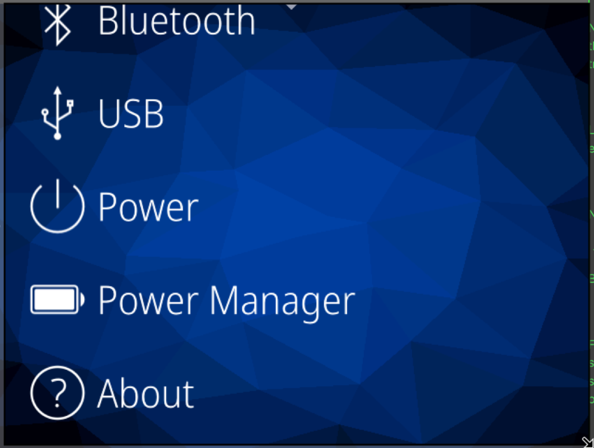
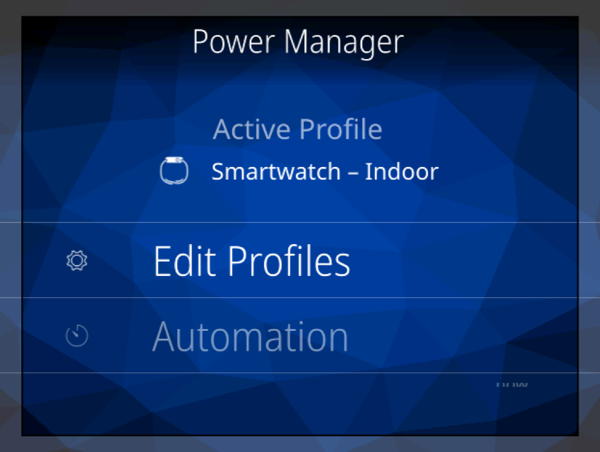
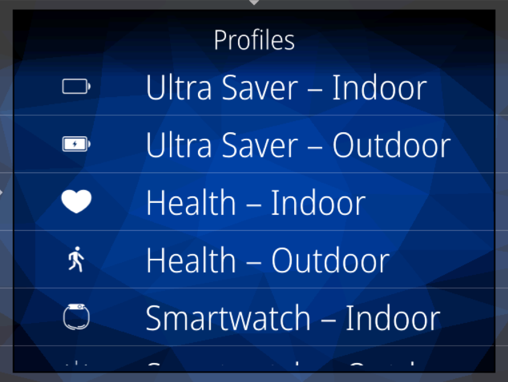
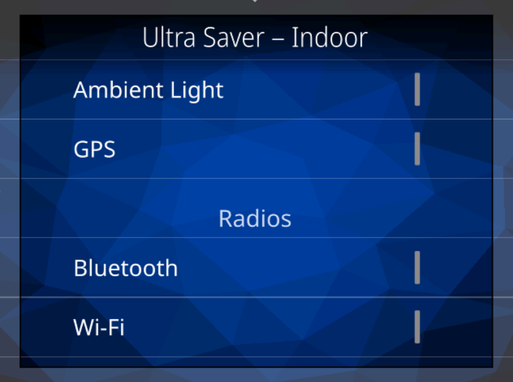

# asteroid-powerd

Power management daemon for [AsteroidOS](https://asteroidos.org/) — profile-based battery management with automation for smartwatches.

<p align="center">
  
  
  
  
</p>

## What is this?

`asteroid-powerd` is a system daemon that gives AsteroidOS watches fine-grained control over **sensors**, **radios**, and **system settings** through named **power profiles**. Instead of a single "battery saver" toggle, you get a whole palette of profiles tuned for different situations — indoor vs outdoor, health tracking vs casual smartwatch use, ultra-saving vs performance workouts — and the daemon can switch between them automatically based on battery level or time of day.

It exposes everything over D-Bus (`org.asteroidos.powerd`) so any UI (like [asteroid-settings](https://github.com/AsteroidOS/asteroid-settings)) can manage profiles, trigger workouts, view battery history, and configure automation rules.

## Features

- **8 built-in profiles** covering common use cases (see [Profiles](#built-in-profiles) below)
- **Custom profiles** — create your own with per-sensor, per-radio granularity
- **Automation engine** — auto-switch profiles on battery thresholds or time-of-day windows
- **Workout mode** — one-tap profile switching for treadmill, outdoor run, cycling, hiking
- **Battery telemetry** — ring-buffer history, drain rate calculation, time-remaining prediction
- **Dual sensor backends** — SensorFW (D-Bus) with sysfs fallback
- **Radio control** — BLE, Wi-Fi, LTE, NFC with sync scheduling (interval, time-window, manual)
- **System control** — Always-on display, tilt-to-wake, background sync via MCE/ConnMan
- **Full D-Bus API** — 14 methods, 5 signals (see [D-Bus Interface](#d-bus-interface))
- **Systemd integration** — D-Bus activated, runs as `asteroid-powerd.service`
- **i18n ready** — 60 language translation templates
- **Comprehensive tests** — 6 unit test programs covering all core components

## Sensor Control

The daemon manages **9 sensors**, each with multiple operating modes. The modes control sampling rate / power draw:

### Accelerometer & Gyroscope

These two share the same mode ladder:

| Mode | Sampling Interval | Frequency | Use Case |
|------|-------------------|-----------|----------|
| **Off** | — | — | Sensor disabled entirely |
| **Low** | 200ms | 5 Hz | Step counting, basic motion detection |
| **Medium** | 40ms | 25 Hz | Gesture recognition, tilt-to-wake |
| **High** | 20ms | 50 Hz | Activity tracking, navigation |
| **Workout** | 10ms | 100 Hz | Full-speed for exercise analysis, rep counting |

**Example:** "Health – Indoor" uses accelerometer=medium (25 Hz) and gyroscope=low (5 Hz) — enough for step counting and coarse gesture detection without draining the battery like full workout mode would.

### Heart Rate

| Mode | Sampling Interval | Use Case |
|------|-------------------|----------|
| **Off** | — | Disabled |
| **Low** | Every 30 min | Resting heart rate spot checks |
| **Medium** | Every 5 min | All-day wellness monitoring |
| **High** | Every 1 min | Active health tracking |
| **Workout** | Every 1 sec | Continuous real-time heart rate during exercise |

### HRV (Heart Rate Variability)

| Mode | Behavior |
|------|----------|
| **Off** | Disabled |
| **Sleep Only** | Active only during detected sleep periods |
| **Always** | Continuous HRV tracking |

### SpO2 (Blood Oxygen)

| Mode | Behavior |
|------|----------|
| **Off** | Disabled |
| **Periodic** | Spot checks at regular intervals |
| **Continuous** | Always-on SpO2 reading |

### Barometer

| Mode | Behavior |
|------|----------|
| **Off** | Disabled |
| **Low** | Infrequent pressure readings (weather trends) |
| **High** | Frequent readings (altitude tracking, floor counting) |

### Compass (Magnetometer)

| Mode | Behavior |
|------|----------|
| **Off** | Disabled |
| **On-Demand** | Active only when an app requests heading |
| **Continuous** | Always-on (for navigation, map apps) |

### Ambient Light Sensor

| Mode | Behavior |
|------|----------|
| **Off** | Disabled |
| **Low** | Infrequent readings (auto-brightness) |
| **High** | Frequent readings (outdoor sunlight adaptation) |

### GPS

| Mode | Behavior |
|------|----------|
| **Off** | Disabled |
| **Periodic** | 60-second duty cycle — gets a fix, sleeps, repeats |
| **Continuous** | Always-on (outdoor runs, hiking, cycling) |

## The Fill-Bar UI

In the settings app, each sensor and radio appears as a row with a **vertical fill bar** on the right side. This is a multi-state toggle — tap the row to cycle through the available modes:

```
 ┌─────────────────────────────┬───┐
 │ Accelerometer          Low  │▐  │  ← 25% filled (green from bottom)
 ├─────────────────────────────┼───┤
 │ Gyroscope              Off  │▐  │  ← 0% filled (all grey)
 ├─────────────────────────────┼───┤
 │ Heart Rate             High │▐  │  ← 75% filled
 ├─────────────────────────────┼───┤
 │ GPS              Continuous │▐  │  ← 100% filled (all green)
 └─────────────────────────────┴───┘
```

The fill level maps directly to the mode position in the mode ladder:
- **0%** (grey) = Off
- **25%** = Low
- **50%** = Medium
- **75%** = High
- **100%** (full green) = Workout / Continuous / Always

For binary toggles like BLE or NFC (just off/on), the bar is either fully grey or fully green. The fill bar gives you an instant visual read of how "aggressive" each sensor's power draw is across the whole profile.

## Radio Control

Four radios are managed, each with independent power and sync scheduling:

### BLE (Bluetooth Low Energy)
- **State:** Off / On
- **Sync Mode:** Manual, Interval (1h–24h), or Time Window
- **Sleep disable:** Optionally turn off BLE during detected sleep

### Wi-Fi
- **State:** Off / On
- **Sync Mode:** Manual, Interval, or Time Window
- **Sleep disable:** Optional

### LTE (Cellular)
- **State:** Off / Calls Only / Always
- "Calls Only" keeps the radio in low-power standby, waking only for incoming calls

### NFC
- **State:** Off / On

## System Settings

| Setting | Options | What it does |
|---------|---------|--------------|
| **Background Sync** | Auto / When Radios On / Off | Controls whether apps can sync data in the background |
| **Always-On Display** | On / Off | Keep screen dimly lit (via MCE `display/use-low-power-mode`) |
| **Tilt to Wake** | On / Off | Wake screen on wrist raise (via MCE `display/enable-gesture-actions`) |

These are applied through MCE (Mode Control Entity) and ConnMan D-Bus interfaces.

## Built-in Profiles

| Profile | Accel | Gyro | HR | HRV | SpO2 | Baro | Compass | ALS | GPS | BLE | Wi-Fi | AOD | Use Case |
|---------|-------|------|----|-----|------|------|---------|-----|-----|-----|-------|-----|----------|
| **Ultra Saver – Indoor** | Low | Off | Off | Off | Off | Off | Off | Off | Off | Off | Off | Off | Maximum battery life, at home |
| **Ultra Saver – Outdoor** | Low | Off | Low | Off | Off | Low | On-Demand | Low | Periodic | On (10h) | Off | Off | Light outdoor, battery critical |
| **Health – Indoor** | Med | Low | High | Sleep | Off | Off | Off | Low | Off | On (2h) | Off | Off | Gym, indoor health tracking |
| **Health – Outdoor** | Med | Med | High | Sleep | Off | Low | On-Demand | Low | Continuous | On (1h) | Off | Off | Running, walking outdoors |
| **Smartwatch – Indoor** | Med | Med | Med | Off | Off | Off | Off | Low | Off | On | On (2h) | On | Daily wear at home/office |
| **Smartwatch – Outdoor** | Med | Med | Med | Off | Off | Low | On-Demand | High | Periodic | On | Off | On | Daily wear outside |
| **Performance – Outdoor** | Max | Max | Max | Always | Continuous | High | Continuous | High | Continuous | On | Off | On | Full workout tracking |

## Automation

### Battery Rules
Automatically switch profiles when battery drops below a threshold:

```json
{
  "threshold": 20,
  "switch_to_profile": "ultra_saver_indoor"
}
```

When battery hits 20%, the daemon auto-switches to Ultra Saver to stretch remaining charge.

### Time Rules
Schedule profile switches by time of day:

```json
{
  "start": "23:00",
  "end": "07:00",
  "switch_to_profile": "ultra_saver_indoor"
}
```

Automatically enter Ultra Saver overnight and revert in the morning.

### Workout Mapping
Pre-assign profiles to workout types for one-tap switching:

```json
{
  "treadmill": "health_indoor",
  "outdoor_run": "health_outdoor",
  "cycling": "performance_outdoor",
  "hiking": "health_outdoor"
}
```

## D-Bus Interface

Service: `org.asteroidos.powerd`
Object: `/org/asteroidos/powerd`
Interface: `org.asteroidos.powerd.ProfileManager`

### Methods

| Method | Args | Returns | Description |
|--------|------|---------|-------------|
| `GetProfiles` | — | JSON string | List all profiles |
| `GetActiveProfile` | — | Profile ID | Currently active profile |
| `SetActiveProfile` | `id: string` | `bool` | Switch to a profile |
| `GetProfile` | `id: string` | JSON string | Get one profile's full config |
| `UpdateProfile` | `json: string` | `bool` | Update an existing profile |
| `AddProfile` | `json: string` | Profile ID | Create a new profile, returns its ID |
| `DeleteProfile` | `id: string` | `bool` | Remove a profile (built-ins protected) |
| `StartWorkout` | `type: string` | `bool` | Start workout, switch to mapped profile |
| `StopWorkout` | — | `bool` | End workout, revert to previous profile |
| `GetWorkoutProfiles` | — | JSON string | Get workout→profile mapping |
| `SetWorkoutProfile` | `type, id: string` | `bool` | Map a workout type to a profile |
| `GetBatteryHistory` | `hours: int` | JSON string | Battery level history |
| `GetBatteryPrediction` | — | JSON string | Drain rate + time remaining estimate |
| `GetCurrentState` | — | JSON string | Full daemon state snapshot |

### Signals

| Signal | Args | When |
|--------|------|------|
| `ActiveProfileChanged` | `id, name` | Profile switch occurs |
| `ProfilesChanged` | — | A profile is added, updated, or deleted |
| `WorkoutStarted` | `type, profileId` | Workout begins |
| `WorkoutStopped` | — | Workout ends |
| `BatteryLevelChanged` | `level, charging` | Battery level changes |

## Building

### Dependencies

- Qt 5.12+ (Core, DBus, Test)
- CMake 3.10+
- Systemd (for service installation)

### Compile

```bash
mkdir build && cd build
cmake ..
make
```

### Run tests

```bash
cd build
ctest --output-on-failure
```

### Install (on device)

```bash
make install
systemctl enable asteroid-powerd
systemctl start asteroid-powerd
```

Or via the AsteroidOS Yocto build system:

```bash
source oe-core/oe-init-build-env build
bitbake asteroid-powerd
```

## Architecture

```
┌──────────────────────────────────────────────┐
│              D-Bus Interface                 │
│    org.asteroidos.powerd.ProfileManager      │
└────────────────────┬─────────────────────────┘
                     │
         ┌───────────┴───────────┐
         │    Profile Manager    │
         │  (JSON load/save)     │
         └───────────┬───────────┘
                     │
    ┌────────────────┼────────────────┐
    │                │                │
┌───┴───┐    ┌──────┴──────┐   ┌─────┴─────┐
│Sensor │    │   Radio     │   │  System   │
│Control│    │  Controller │   │ Controller│
└───┬───┘    └──────┬──────┘   └─────┬─────┘
    │               │                │
┌───┴───┐    ┌──────┴──────┐   ┌─────┴─────┐
│SensorFW│   │BlueZ/ConnMan│   │    MCE     │
│ sysfs  │   │  D-Bus      │   │   D-Bus    │
└────────┘   └─────────────┘   └───────────┘
                     │
         ┌───────────┴───────────┐
         │  Automation Engine    │
         │ (battery/time rules)  │
         └───────────┬───────────┘
                     │
         ┌───────────┴───────────┐
         │   Battery Monitor     │
         │ (ring buffer, predict)│
         └───────────────────────┘
```

## Known Issues / TODO

This is a first version — it works, but there are known areas to improve:

- **SensorFW race condition**: The `availableSensors()` D-Bus call is async, so the sensor list may be empty at first check. Currently falls back to sysfs, which works fine in practice.
- **Workout state sync**: The workout active/inactive state between `DBusInterface` and `AutomationEngine` can get out of sync in edge cases.
- **GPS timer lifecycle**: The periodic GPS timer isn't cleanly stopped in all code paths.
- **Screen-on detection**: `screenOn` state tracking is not yet wired up.
- **TimeWindow sync mode**: Only fires once rather than repeating on a schedule.

## License

GNU General Public License v3.0 — see [LICENSE](LICENSE).

## Contributing

This project is in early development. Issues and pull requests are welcome!

If you're from the AsteroidOS organization and would like to adopt this repo, please reach out — we'd love to see `asteroid-powerd` become an official part of AsteroidOS.
